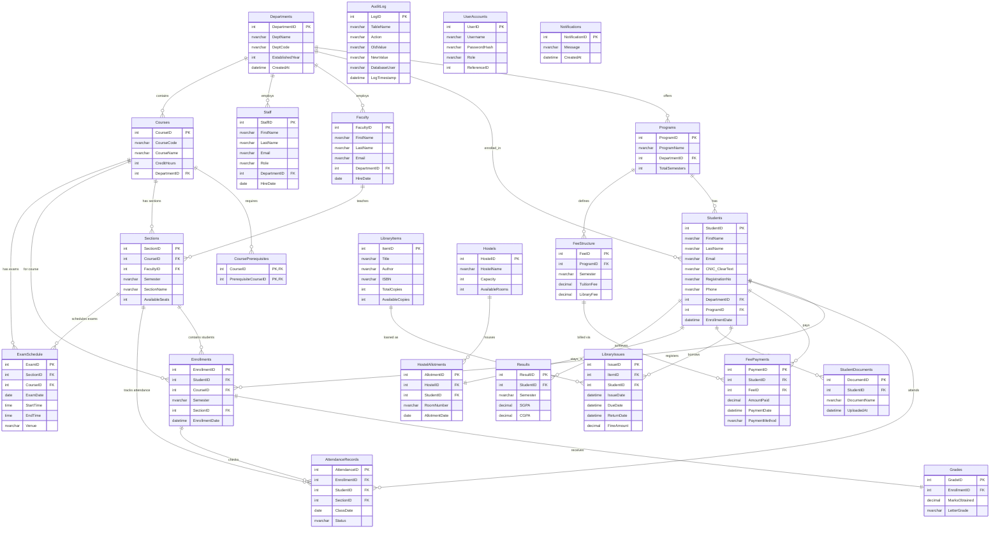
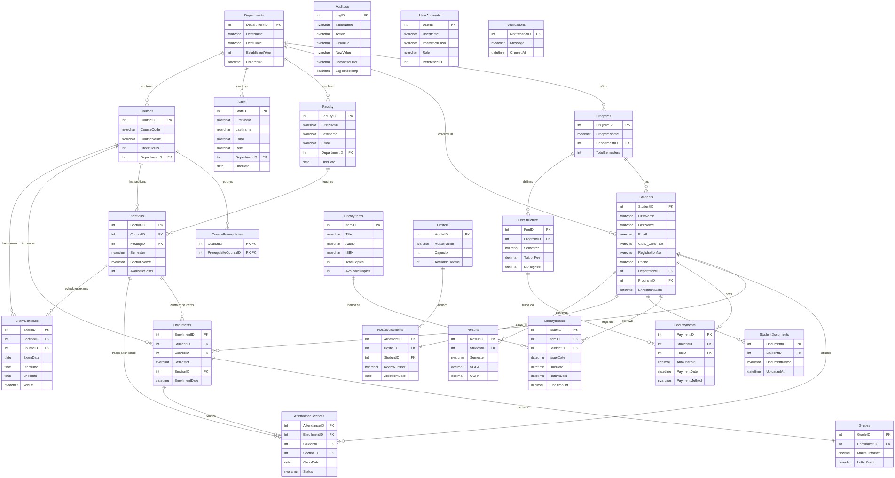

# Entity-Relationship (ER) Diagram - HiSUP Database

This document contains a comprehensive Entity-Relationship (ER) Diagram mapping out the relational schema for the HITEC University Academic Data Management System (HiSUP) database.

## 1. Database ER Diagram

The following interactive vector ER diagram displays all 23 database tables, their attributes (with data types, primary keys, and foreign keys), and the cardinalities between entities.

### Static Image Version
For environments that do not automatically render Mermaid syntax, here is the generated PNG image of the ER Diagram:

## 2. Core Functional Modules

The database structure is organized into six major functional areas:

### 2.1 Academic Infrastructure
- **Departments & Programs**: Forms the hierarchical root. Departments offer multiple Programs.
- **Courses**: Belong to a Department and can have zero-to-many Prerequisites linked self-referentially via `CoursePrerequisites`.
- **Sections**: Represent specific instances of Courses being taught by a Faculty member in a given Semester.

### 2.2 Personnel & Users
- **Students, Faculty, & Staff**: Connect back to their host Departments.
- **UserAccounts**: Manages authentication credentials and role mappings (`Admin`, `Student`, `Faculty`, `Finance`, `Library`), where `ReferenceID` links back to the respective `StudentID`, `FacultyID`, or `StaffID`.

### 2.3 Registration, Attendance, & Grading
- **Enrollments**: Bridges `Students` to their selected `Sections`.
- **Grades**: Has a 1:1 relationship with `Enrollments` to store numeric marks and letter grades.
- **AttendanceRecords**: Tracks daily student presence status ('Present', 'Absent', 'Leave', 'Late') per section.

### 2.4 Finance & Billing
- **FeeStructure**: Defines semester billing limits mapped to degree `Programs`.
- **FeePayments**: Tracks invoices paid by `Students` applied against a specific `FeeStructure`.

### 2.5 Resources & Logistics
- **LibraryItems & Issues**: Manages physical book inventory and borrow logs containing check-out logs and calculated late fines.
- **Hostels & Allotments**: Models hostel building inventory and assigns rooms to students with a unique constraint ensuring a student is allotted to at most one room.

### 2.6 Examinations & Auditing
- **ExamSchedule**: Maps exam date, timing, and venue to academic `Sections` and `Courses`.
- **Results**: Archival ledger tracking semester-by-semester SGPA and CGPA results.
- **AuditLog**: Automated database-trigger logs tracking changes made to the `Students` table.
