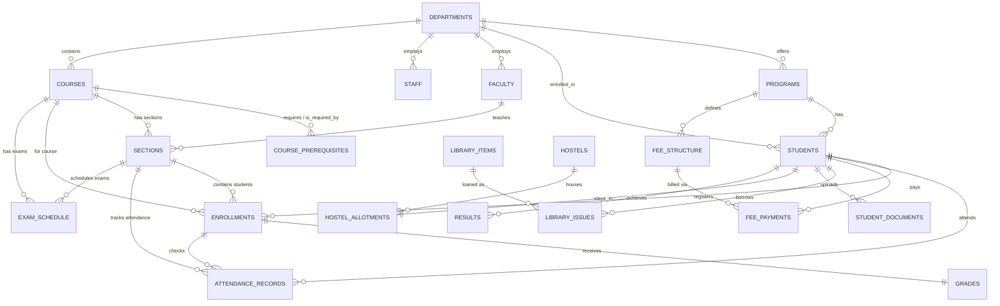

# HITEC University Management System (HiSUP)
## Comprehensive Database Architecture & Project Report

---

## 1. Executive Summary

**HiSUP (HITEC University System Update Portal)** is a centralized, enterprise-grade university management system designed to coordinate and streamline academic, administrative, financial, and logistical operations at HITEC University. 

By integrating diverse operational divisions—ranging from department enrollment, curriculum prerequisites, and course scheduling to student finance tracking, library item logistics, and hostel room assignments—HiSUP replaces isolated legacy structures with a unified, high-integrity data model.

The platform is built using a modern **ASP.NET Core 8.0 MVC** backend and a robust **Microsoft SQL Server** relational database, accessed via **Entity Framework Core (EF Core)**. Security and multi-tenant isolation are implemented at the database level using **Row-Level Security (RLS)**, **Session Contexts**, and granular database schemas. This ensures that student privacy, faculty data constraints, and financial accountability are enforced directly by the SQL Server engine, providing a defense-in-depth security model.

---

## 2. System Architecture & Tech Stack

```
┌────────────────────────────────────────────────────────┐
│                   Client Browser                       │
└──────────────────────────┬─────────────────────────────┘
                           │ HTTPS Request
                           ▼
┌────────────────────────────────────────────────────────┐
│              ASP.NET Core 8.0 MVC Web App              │
│    Controllers   ◄───►   ViewModels   ◄───►   Views     │
└──────────────────────────┬─────────────────────────────┘
                           │ ORM Querying
                           ▼
┌────────────────────────────────────────────────────────┐
│                 Entity Framework Core                  │
│       ──────────────────────────────────────────       │
│      SessionConnectionInterceptor (Injects Claims)     │
└──────────────────────────┬─────────────────────────────┘
                           │ ADO.NET Connection (Session Context)
                           ▼
┌────────────────────────────────────────────────────────┐
│                   MS SQL Server DB                     │
│  Row-Level Security (RLS)  │  Stored Procs & Triggers  │
│  Views & Window Functions  │  Custom Security Roles    │
└────────────────────────────────────────────────────────┘
```

* **Core Framework:** ASP.NET Core 8.0 MVC (Model-View-Controller) utilizing C# 12.
* **Data Access Layer:** Entity Framework Core (Code-First mapping with Database-First schema constraints).
* **Security Interceptor:** `SessionConnectionInterceptor` intercepts database connections on opening to inject HTTP session claims (`UserRole`, `StudentID`, `FacultyID`) directly into the SQL Server connection session context using `sp_set_session_context`.
* **Database Engine:** Microsoft SQL Server (T-SQL).
* **Database Features:** Schema-bound Views, SQL Window Functions, Row-Level Security Predicates, Security Policies, Transactional Stored Procedures, Audit Triggers, User-Defined Functions (UDFs), and Custom Database Roles.

---

## 3. Entity-Relationship Diagram (ERD)

Below is the Entity-Relationship Diagram (ERD) mapping out the relationships across all modules.




---

## 4. Relational Database Schema & Data Dictionary

The database consists of **23 relational tables**. Below is the exhaustive layout of all fields, data types, constraints, and relationships.

### 4.1 Academic & Department Infrastructure

#### Table 1: `Departments`
Stores general metadata about the university's academic departments.
* **Primary Key:** `DepartmentID` (INT IDENTITY(1,1))
* **Constraints:** `DeptName` (Unique, Not Null), `DeptCode` (Unique, Not Null), `EstablishedYear` (CHECK >= 1990)

| Column Name | Data Type | Key Type | Nullability | Constraints / Default | Description |
| :--- | :--- | :---: | :---: | :--- | :--- |
| `DepartmentID` | INT | PK | NOT NULL | IDENTITY(1,1) | Auto-incrementing department ID. |
| `DeptName` | NVARCHAR(100) | - | NOT NULL | UNIQUE | Full name of the department. |
| `DeptCode` | NVARCHAR(10) | - | NOT NULL | UNIQUE | Short code (e.g., CS, EE). |
| `EstablishedYear`| INT | - | NULL | CHECK (>= 1990) | The year department was founded. |
| `CreatedAt` | DATETIME | - | NULL | DEFAULT GETDATE() | Database creation record timestamp. |

#### Table 2: `Programs`
Degree programs offered within departments.
* **Primary Key:** `ProgramID` (INT IDENTITY(1,1))
* **Foreign Key:** `DepartmentID` references `Departments(DepartmentID)`
* **Constraints:** `ProgramName` (Unique, Not Null), `TotalSemesters` (CHECK > 0)

| Column Name | Data Type | Key Type | Nullability | Constraints / Default | Description |
| :--- | :--- | :---: | :---: | :--- | :--- |
| `ProgramID` | INT | PK | NOT NULL | IDENTITY(1,1) | Auto-incrementing program ID. |
| `ProgramName` | NVARCHAR(100) | - | NOT NULL | UNIQUE | Name of degree (e.g., BS Computer Science).|
| `DepartmentID` | INT | FK | NOT NULL | References `Departments` | The department hosting this program. |
| `TotalSemesters` | INT | - | NULL | CHECK (> 0) | Total semester durations. |

#### Table 3: `Courses`
Subject syllabi catalog details.
* **Primary Key:** `CourseID` (INT IDENTITY(1,1))
* **Foreign Key:** `DepartmentID` references `Departments(DepartmentID)`
* **Constraints:** `CourseCode` (Unique, Not Null), `CreditHours` (CHECK BETWEEN 1 AND 4)

| Column Name | Data Type | Key Type | Nullability | Constraints / Default | Description |
| :--- | :--- | :---: | :---: | :--- | :--- |
| `CourseID` | INT | PK | NOT NULL | IDENTITY(1,1) | Auto-incrementing course ID. |
| `CourseCode` | NVARCHAR(20) | - | NOT NULL | UNIQUE | Code of course (e.g., CS-202). |
| `CourseName` | NVARCHAR(100) | - | NOT NULL | - | Course title. |
| `CreditHours` | INT | - | NULL | CHECK (1 TO 4) | Credit hour weighting. |
| `DepartmentID` | INT | FK | NOT NULL | References `Departments` | Hosting department ID. |

#### Table 4: `CoursePrerequisites`
A self-referencing relationship mapping courses to their required prerequisites.
* **Composite Primary Key:** `(CourseID, PrerequisiteCourseID)`
* **Foreign Keys:** 
  * `CourseID` references `Courses(CourseID)`
  * `PrerequisiteCourseID` references `Courses(CourseID)`

| Column Name | Data Type | Key Type | Nullability | Constraints / Default | Description |
| :--- | :--- | :---: | :---: | :--- | :--- |
| `CourseID` | INT | PK, FK | NOT NULL | References `Courses` | The core course requiring a prerequisite. |
| `PrerequisiteCourseID`| INT | PK, FK | NOT NULL | References `Courses` | The prerequisite course required first. |

---

### 4.2 Personnel & Users

#### Table 5: `Students`
Comprehensive profiles of enrolled students.
* **Primary Key:** `StudentID` (INT IDENTITY(1000,1))
* **Foreign Keys:**
  * `DepartmentID` references `Departments(DepartmentID)`
  * `ProgramID` references `Programs(ProgramID)`
* **Constraints:** `Email` (Unique, Not Null)

| Column Name | Data Type | Key Type | Nullability | Constraints / Default | Description |
| :--- | :--- | :---: | :---: | :--- | :--- |
| `StudentID` | INT | PK | NOT NULL | IDENTITY(1000,1) | Student ID starting at 1000. |
| `FirstName` | NVARCHAR(50) | - | NOT NULL | - | First name. |
| `LastName` | NVARCHAR(50) | - | NOT NULL | - | Last name. |
| `Email` | NVARCHAR(100) | - | NOT NULL | UNIQUE | Academic email. |
| `CNIC_ClearText` | NVARCHAR(15) | - | NULL | - | CNIC number. |
| `RegistrationNo` | NVARCHAR(20) | - | NULL | - | Registration number format (e.g. 22-CS-1000).|
| `Phone` | NVARCHAR(20) | - | NULL | - | Student contact number. |
| `DepartmentID` | INT | FK | NOT NULL | References `Departments` | Associated department. |
| `ProgramID` | INT | FK | NULL | References `Programs` | Enrolled degree program. |
| `EnrollmentDate` | DATETIME | - | NULL | DEFAULT GETDATE() | Record creation date. |

#### Table 6: `Faculty`
University academic faculty listings.
* **Primary Key:** `FacultyID` (INT IDENTITY(1,1))
* **Foreign Key:** `DepartmentID` references `Departments(DepartmentID)`
* **Constraints:** `Email` (Unique, Not Null)

| Column Name | Data Type | Key Type | Nullability | Constraints / Default | Description |
| :--- | :--- | :---: | :---: | :--- | :--- |
| `FacultyID` | INT | PK | NOT NULL | IDENTITY(1,1) | Auto-incrementing faculty ID. |
| `FirstName` | NVARCHAR(50) | - | NOT NULL | - | Faculty first name. |
| `LastName` | NVARCHAR(50) | - | NOT NULL | - | Faculty last name. |
| `Email` | NVARCHAR(100) | - | NOT NULL | UNIQUE | Faculty corporate email. |
| `DepartmentID` | INT | FK | NOT NULL | References `Departments` | Home department ID. |
| `HireDate` | DATE | - | NULL | DEFAULT GETDATE() | Hiring date. |

#### Table 7: `Staff`
Non-academic administrative staff listings.
* **Primary Key:** `StaffID` (INT IDENTITY(1,1))
* **Foreign Key:** `DepartmentID` references `Departments(DepartmentID)`
* **Constraints:** `Email` (Unique, Not Null)

| Column Name | Data Type | Key Type | Nullability | Constraints / Default | Description |
| :--- | :--- | :---: | :---: | :--- | :--- |
| `StaffID` | INT | PK | NOT NULL | IDENTITY(1,1) | Auto-incrementing staff ID. |
| `FirstName` | NVARCHAR(50) | - | NOT NULL | - | Staff first name. |
| `LastName` | NVARCHAR(50) | - | NOT NULL | - | Staff last name. |
| `Email` | NVARCHAR(100) | - | NOT NULL | UNIQUE | Staff corporate email. |
| `Role` | NVARCHAR(50) | - | NOT NULL | - | Administrative role designation. |
| `DepartmentID` | INT | FK | NULL | References `Departments` | Department assigned (if any). |
| `HireDate` | DATE | - | NULL | DEFAULT GETDATE() | Hiring date. |

#### Table 8: `UserAccounts`
Login credentials for application portal access.
* **Primary Key:** `UserID` (INT IDENTITY(1,1))
* **Constraints:** `Username` (Unique, Not Null), `Role` (CHECK IN Admin, Student, Faculty, Finance, Library)

| Column Name | Data Type | Key Type | Nullability | Constraints / Default | Description |
| :--- | :--- | :---: | :---: | :--- | :--- |
| `UserID` | INT | PK | NOT NULL | IDENTITY(1,1) | Auto-incrementing login user ID. |
| `Username` | NVARCHAR(50) | - | NOT NULL | UNIQUE | Login username. |
| `PasswordHash` | NVARCHAR(255) | - | NOT NULL | - | Secured hashed password value. |
| `Role` | NVARCHAR(20) | - | NULL | CHECK constraint | Portal role mapping. |
| `ReferenceID` | INT | - | NOT NULL | DEFAULT 0 | References identity ID based on Role (e.g. StudentID). |

---

### 4.3 Registrations, Grading & Attendance

#### Table 9: `Sections`
Class schedule sections for courses.
* **Primary Key:** `SectionID` (INT IDENTITY(1,1))
* **Foreign Keys:**
  * `CourseID` references `Courses(CourseID)`
  * `FacultyID` references `Faculty(FacultyID)`
* **Constraints:** `AvailableSeats` (CHECK >= 0), Unique Composite Constraint `UQ_Course_Section` `(CourseID, Semester, SectionName)`

| Column Name | Data Type | Key Type | Nullability | Constraints / Default | Description |
| :--- | :--- | :---: | :---: | :--- | :--- |
| `SectionID` | INT | PK | NOT NULL | IDENTITY(1,1) | Auto-incrementing section ID. |
| `CourseID` | INT | FK | NOT NULL | References `Courses` | Course offered in this section. |
| `FacultyID` | INT | FK | NOT NULL | References `Faculty` | Assigned teacher. |
| `Semester` | NVARCHAR(20) | - | NOT NULL | - | Target semester term (e.g. Spring 2025). |
| `SectionName` | NVARCHAR(10) | - | NOT NULL | - | Section identifier (A, B, C etc.). |
| `AvailableSeats` | INT | - | NULL | DEFAULT 40, CHECK(>=0) | Remaining seating capacity. |

#### Table 10: `Enrollments`
Registers students into course sections.
* **Primary Key:** `EnrollmentID` (INT IDENTITY(1,1))
* **Foreign Keys:**
  * `StudentID` references `Students(StudentID)` ON DELETE CASCADE
  * `CourseID` references `Courses(CourseID)`
  * `SectionID` references `Sections(SectionID)`

| Column Name | Data Type | Key Type | Nullability | Constraints / Default | Description |
| :--- | :--- | :---: | :---: | :--- | :--- |
| `EnrollmentID` | INT | PK | NOT NULL | IDENTITY(1,1) | Auto-incrementing enrollment record ID. |
| `StudentID` | INT | FK | NOT NULL | References `Students` | Enrolling student. |
| `CourseID` | INT | FK | NULL | References `Courses` | Registered course (synced via trigger). |
| `Semester` | NVARCHAR(20) | - | NULL | - | Semester period. |
| `SectionID` | INT | FK | NULL | References `Sections` | Section assigned to. |
| `EnrollmentDate` | DATETIME | - | NULL | DEFAULT GETDATE() | Enrollment registration time. |

#### Table 11: `Grades`
Student marks and letter grades for enrolled courses.
* **Primary Key:** `GradeID` (INT IDENTITY(1,1))
* **Foreign Key:** `EnrollmentID` references `Enrollments(EnrollmentID)` ON DELETE CASCADE
* **Constraints:** `EnrollmentID` (Unique), `MarksObtained` (CHECK >= 0 AND <= 100)

| Column Name | Data Type | Key Type | Nullability | Constraints / Default | Description |
| :--- | :--- | :---: | :---: | :--- | :--- |
| `GradeID` | INT | PK | NOT NULL | IDENTITY(1,1) | Auto-incrementing grade ID. |
| `EnrollmentID` | INT | FK | NOT NULL | UNIQUE, References `Enrollments` | Specific enrollment course record. |
| `MarksObtained` | DECIMAL(5,2) | - | NULL | CHECK (0.00 TO 100.00) | Numeric assessment score. |
| `LetterGrade` | NVARCHAR(2) | - | NULL | - | Calculated letter grade (A, B, C, D, F). |

#### Table 12: `AttendanceRecords`
Daily lecture attendance.
* **Primary Key:** `AttendanceID` (INT IDENTITY(1,1))
* **Foreign Keys:**
  * `EnrollmentID` references `Enrollments(EnrollmentID)` ON DELETE CASCADE
  * `StudentID` references `Students(StudentID)`
  * `SectionID` references `Sections(SectionID)`
* **Constraints:** `Status` (CHECK IN ('Present', 'Absent', 'Leave', 'Late'))

| Column Name | Data Type | Key Type | Nullability | Constraints / Default | Description |
| :--- | :--- | :---: | :---: | :--- | :--- |
| `AttendanceID` | INT | PK | NOT NULL | IDENTITY(1,1) | Auto-incrementing attendance ID. |
| `EnrollmentID` | INT | FK | NULL | References `Enrollments` | Connected course enrollment. |
| `StudentID` | INT | FK | NULL | References `Students` | Attendance student. |
| `SectionID` | INT | FK | NULL | References `Sections` | Lecture section context. |
| `ClassDate` | DATE | - | NOT NULL | - | Specific class date. |
| `Status` | NVARCHAR(10) | - | NULL | CHECK constraint | Attendance status. |

---

### 4.4 Finance & Billing

#### Table 13: `FeeStructure`
Academic tuition fee rates configured by degree program and semester.
* **Primary Key:** `FeeID` (INT IDENTITY(1,1))
* **Foreign Key:** `ProgramID` references `Programs(ProgramID)`
* **Constraints:** `TuitionFee` (CHECK >= 0)

| Column Name | Data Type | Key Type | Nullability | Constraints / Default | Description |
| :--- | :--- | :---: | :---: | :--- | :--- |
| `FeeID` | INT | PK | NOT NULL | IDENTITY(1,1) | Auto-incrementing fee structure ID. |
| `ProgramID` | INT | FK | NOT NULL | References `Programs` | Program billed. |
| `Semester` | NVARCHAR(20) | - | NOT NULL | - | Applicable semester. |
| `TuitionFee` | DECIMAL(10,2) | - | NULL | CHECK (>= 0) | Base tuition charges. |
| `LibraryFee` | DECIMAL(10,2) | - | NULL | DEFAULT 0 | Standard library processing charges. |

#### Table 14: `FeePayments`
Financial transactions for outstanding fee settlement.
* **Primary Key:** `PaymentID` (INT IDENTITY(1,1))
* **Foreign Keys:**
  * `StudentID` references `Students(StudentID)` ON DELETE CASCADE
  * `FeeID` references `FeeStructure(FeeID)`
* **Constraints:** `AmountPaid` (CHECK > 0)

| Column Name | Data Type | Key Type | Nullability | Constraints / Default | Description |
| :--- | :--- | :---: | :---: | :--- | :--- |
| `PaymentID` | INT | PK | NOT NULL | IDENTITY(1,1) | Auto-incrementing payment ID. |
| `StudentID` | INT | FK | NOT NULL | References `Students` | Payer student ID. |
| `FeeID` | INT | FK | NOT NULL | References `FeeStructure` | Fee structure record applied. |
| `AmountPaid` | DECIMAL(10,2) | - | NULL | CHECK (> 0) | Amount transferred. |
| `PaymentDate` | DATETIME | - | NULL | DEFAULT GETDATE() | Transaction timestamp. |
| `PaymentMethod` | NVARCHAR(50) | - | NULL | - | Transaction channel (e.g. Bank). |

---

### 4.5 Resource & Logistics Modules

#### Table 15: `LibraryItems`
Catalog registry for books and reference materials.
* **Primary Key:** `ItemID` (INT IDENTITY(1,1))
* **Constraints:** `ISBN` (Unique), `TotalCopies` (CHECK >= 0), `AvailableCopies` (CHECK >= 0), `CHK_Copies` (CHECK AvailableCopies <= TotalCopies)

| Column Name | Data Type | Key Type | Nullability | Constraints / Default | Description |
| :--- | :--- | :---: | :---: | :--- | :--- |
| `ItemID` | INT | PK | NOT NULL | IDENTITY(1,1) | Auto-incrementing book record ID. |
| `Title` | NVARCHAR(200) | - | NOT NULL | - | Book title. |
| `Author` | NVARCHAR(100) | - | NULL | - | Author name. |
| `ISBN` | NVARCHAR(20) | - | NULL | UNIQUE | Unique international book code. |
| `TotalCopies` | INT | - | NULL | CHECK (>= 0) | Volume stock purchased. |
| `AvailableCopies`| INT | - | NULL | CHECK (>= 0) | Volume stock currently on shelves. |

#### Table 16: `LibraryIssues`
Tracks borrows and returns of library items.
* **Primary Key:** `IssueID` (INT IDENTITY(1,1))
* **Foreign Keys:**
  * `ItemID` references `LibraryItems(ItemID)`
  * `StudentID` references `Students(StudentID)` ON DELETE CASCADE
* **Constraints:** `FineAmount` (CHECK >= 0)

| Column Name | Data Type | Key Type | Nullability | Constraints / Default | Description |
| :--- | :--- | :---: | :---: | :--- | :--- |
| `IssueID` | INT | PK | NOT NULL | IDENTITY(1,1) | Auto-incrementing borrow issue ID. |
| `ItemID` | INT | FK | NOT NULL | References `LibraryItems` | Borrowed item ID. |
| `StudentID` | INT | FK | NOT NULL | References `Students` | Borrowing student. |
| `IssueDate` | DATETIME | - | NULL | DEFAULT GETDATE() | Issue timestamp. |
| `DueDate` | DATETIME | - | NOT NULL | - | Deadline return date. |
| `ReturnDate` | DATETIME | - | NULL | - | Actual return timestamp. |
| `FineAmount` | DECIMAL(10,2) | - | NULL | DEFAULT 0, CHECK (>= 0) | Fine due for late submissions. |

#### Table 17: `Hostels`
Residential hostel dorm buildings.
* **Primary Key:** `HostelID` (INT IDENTITY(1,1))
* **Constraints:** `HostelName` (Unique, Not Null), `Capacity` (CHECK > 0), `AvailableRooms` (CHECK >= 0)

| Column Name | Data Type | Key Type | Nullability | Constraints / Default | Description |
| :--- | :--- | :---: | :---: | :--- | :--- |
| `HostelID` | INT | PK | NOT NULL | IDENTITY(1,1) | Auto-incrementing hostel ID. |
| `HostelName` | NVARCHAR(100) | - | NOT NULL | UNIQUE | Unique room building name. |
| `Capacity` | INT | - | NULL | CHECK (> 0) | Maximum bedding capacity. |
| `AvailableRooms` | INT | - | NULL | CHECK (>= 0) | Available rooms remaining. |

#### Table 18: `HostelAllotments`
Resident student assignments.
* **Primary Key:** `AllotmentID` (INT IDENTITY(1,1))
* **Foreign Keys:**
  * `HostelID` references `Hostels(HostelID)`
  * `StudentID` references `Students(StudentID)` ON DELETE CASCADE
* **Constraints:** `StudentID` (Unique)

| Column Name | Data Type | Key Type | Nullability | Constraints / Default | Description |
| :--- | :--- | :---: | :---: | :--- | :--- |
| `AllotmentID` | INT | PK | NOT NULL | IDENTITY(1,1) | Auto-incrementing allotment ID. |
| `HostelID` | INT | FK | NOT NULL | References `Hostels` | Target hostel building. |
| `StudentID` | INT | FK | NOT NULL | UNIQUE, References `Students` | Assigned student. |
| `RoomNumber` | NVARCHAR(10) | - | NOT NULL | - | Designated room code. |
| `AllotmentDate` | DATE | - | NULL | DEFAULT GETDATE() | Date of allotment. |

---

### 4.6 Examinations, Results & Audits

#### Table 19: `ExamSchedule`
Exams venue scheduling per course section.
* **Primary Key:** `ExamID` (INT IDENTITY(1,1))
* **Foreign Keys:**
  * `SectionID` references `Sections(SectionID)` ON DELETE CASCADE
  * `CourseID` references `Courses(CourseID)`

| Column Name | Data Type | Key Type | Nullability | Constraints / Default | Description |
| :--- | :--- | :---: | :---: | :--- | :--- |
| `ExamID` | INT | PK | NOT NULL | IDENTITY(1,1) | Auto-incrementing exam scheduling ID. |
| `SectionID` | INT | FK | NOT NULL | References `Sections` | Target student section. |
| `CourseID` | INT | FK | NULL | References `Courses` | Evaluated course. |
| `ExamDate` | DATE | - | NOT NULL | - | Examination date. |
| `StartTime` | TIME | - | NOT NULL | - | Assessment start. |
| `EndTime` | TIME | - | NOT NULL | - | Assessment wrap up. |
| `Venue` | NVARCHAR(50) | - | NOT NULL | - | Location room/hall venue. |

#### Table 20: `Results`
Academic cumulative GPAs by semester.
* **Primary Key:** `ResultID` (INT IDENTITY(1,1))
* **Foreign Key:** `StudentID` references `Students(StudentID)` ON DELETE CASCADE
* **Constraints:** Unique Composite Constraint `UQ_Student_Semester_Result` `(StudentID, Semester)`, `SGPA` (CHECK 0.00 TO 4.00), `CGPA` (CHECK 0.00 TO 4.00)

| Column Name | Data Type | Key Type | Nullability | Constraints / Default | Description |
| :--- | :--- | :---: | :---: | :--- | :--- |
| `ResultID` | INT | PK | NOT NULL | IDENTITY(1,1) | Auto-incrementing result record ID. |
| `StudentID` | INT | FK | NOT NULL | References `Students` | Student ID. |
| `Semester` | NVARCHAR(20) | - | NOT NULL | - | Evaluated semester period. |
| `SGPA` | DECIMAL(3,2) | - | NULL | CHECK (0.00 TO 4.00) | Semester GPA value. |
| `CGPA` | DECIMAL(3,2) | - | NULL | CHECK (0.00 TO 4.00) | Cumulative GPA value. |

#### Table 21: `AuditLog`
Automated system modifications tracker.
* **Primary Key:** `LogID` (INT IDENTITY(1,1))

| Column Name | Data Type | Key Type | Nullability | Constraints / Default | Description |
| :--- | :--- | :---: | :---: | :--- | :--- |
| `LogID` | INT | PK | NOT NULL | IDENTITY(1,1) | Auto-incrementing audit log ID. |
| `TableName` | NVARCHAR(50) | - | NOT NULL | - | Monitored table name (e.g. Students). |
| `Action` | NVARCHAR(10) | - | NOT NULL | - | Type of query trigger (INSERT/UPDATE/DELETE).|
| `OldValue` | NVARCHAR(MAX) | - | NULL | - | Previous record row values. |
| `NewValue` | NVARCHAR(MAX) | - | NULL | - | New updated values. |
| `DatabaseUser` | NVARCHAR(100) | - | NULL | DEFAULT SYSTEM_USER | Executing database user context. |
| `LogTimestamp` | DATETIME | - | NULL | DEFAULT GETDATE() | Occurrence date time. |

#### Table 22: `Notifications`
Global portal notifications registry.
* **Primary Key:** `NotificationID` (INT IDENTITY(1,1))

| Column Name | Data Type | Key Type | Nullability | Constraints / Default | Description |
| :--- | :--- | :---: | :---: | :--- | :--- |
| `NotificationID` | INT | PK | NOT NULL | IDENTITY(1,1) | Auto-incrementing notice record ID. |
| `Message` | NVARCHAR(500) | - | NOT NULL | - | Alert notice body text content. |
| `CreatedAt` | DATETIME | - | NULL | DEFAULT GETDATE() | Publication date. |

#### Table 23: `StudentDocuments`
Official academic document attachments.
* **Primary Key:** `DocumentID` (INT IDENTITY(1,1))
* **Foreign Key:** `StudentID` references `Students(StudentID)` ON DELETE CASCADE

| Column Name | Data Type | Key Type | Nullability | Constraints / Default | Description |
| :--- | :--- | :---: | :---: | :--- | :--- |
| `DocumentID` | INT | PK | NOT NULL | IDENTITY(1,1) | Auto-incrementing document file ID. |
| `StudentID` | INT | FK | NOT NULL | References `Students` | Owning student. |
| `DocumentName` | NVARCHAR(200) | - | NOT NULL | - | Uploaded file name or relative directory. |
| `UploadedAt` | DATETIME | - | NULL | DEFAULT GETDATE() | Upload timestamp. |

---

## 5. Advanced Database Implementation

To meet advanced database system design requirements, the schema utilizes programmatic T-SQL constructs directly at the database engine level.

### 5.1 Stored Procedures & Transaction Management

The stored procedure `EnrollInCourse` handles course enrollments. It uses explicit transaction control and locking mechanisms to guarantee academic integrity during high-concurrency registration events:

```sql
CREATE PROCEDURE EnrollInCourse
    @StudentID INT,
    @CourseID INT,
    @Semester NVARCHAR(20)
AS
BEGIN
    SET NOCOUNT ON;
    BEGIN TRY
        -- Begin explicit transaction block
        BEGIN TRANSACTION;

        DECLARE @AvailableSeats INT;
        
        -- Acquire a Shared Update Lock (UPDLOCK) under Serializable isolation level (SERIALIZABLE)
        -- This prevents concurrent connections from reading the seat count and executing insertions 
        -- until this transaction commits or rolls back, avoiding Phantom Reads/Lost Updates.
        SELECT @AvailableSeats = SUM(AvailableSeats)
        FROM Sections WITH (UPDLOCK, SERIALIZABLE)
        WHERE CourseID = @CourseID AND Semester = @Semester;

        -- Validate seating limits
        IF @AvailableSeats IS NULL OR @AvailableSeats <= 0
            THROW 50002, 'Enrollment Failed: No available seats for this course in the current semester.', 1;

        -- Register the student enrollment
        INSERT INTO Enrollments (StudentID, CourseID, Semester, EnrollmentDate)
        VALUES (@StudentID, @CourseID, @Semester, GETDATE());

        -- Commit changes
        COMMIT TRANSACTION;
    END TRY
    BEGIN CATCH
        -- Rollback on failure to prevent partial state corruption
        IF @@TRANCOUNT > 0 ROLLBACK TRANSACTION;
        THROW;
    END CATCH
END;
```

> [!TIP]
> **Lock Escalation Analysis:**
> The `WITH (UPDLOCK, SERIALIZABLE)` hint forces SQL Server to acquire range locks. It holds these locks until the end of the transaction rather than releasing them immediately after the read. This is crucial for preventing race conditions, such as two students securing the final seat in a course section simultaneously.

---

### 5.2 Database Triggers

Triggers are used to automate data auditing, synchronize relational updates, and enforce business rules that are complex to handle at the application layer.

#### A. Auditing Trigger: `trg_AuditStudentUpdate`
Monitors changes to the `Students` table and logs them to the `AuditLog` table:

```sql
CREATE TRIGGER trg_AuditStudentUpdate
ON Students
AFTER INSERT, UPDATE, DELETE
AS
BEGIN
    SET NOCOUNT ON;
    DECLARE @Action NVARCHAR(10);
    
    -- Determine DML Action type
    IF EXISTS (SELECT * FROM inserted) AND EXISTS (SELECT * FROM deleted)
        SET @Action = 'UPDATE';
    ELSE IF EXISTS (SELECT * FROM inserted)
        SET @Action = 'INSERT';
    ELSE
        SET @Action = 'DELETE';

    -- Audit Inserts or Updates using temporary virtual table 'inserted'
    IF @Action IN ('INSERT', 'UPDATE')
    BEGIN
        INSERT INTO AuditLog (TableName, Action, NewValue, DatabaseUser)
        SELECT 'Students', @Action, CONCAT('StudentID: ', StudentID, ', Name: ', FirstName, ' ', LastName), SYSTEM_USER
        FROM inserted;
    END

    -- Audit Deletions using temporary virtual table 'deleted'
    IF @Action = 'DELETE'
    BEGIN
        INSERT INTO AuditLog (TableName, Action, OldValue, DatabaseUser)
        SELECT 'Students', @Action, CONCAT('StudentID: ', StudentID, ', Name: ', FirstName, ' ', LastName), SYSTEM_USER
        FROM deleted;
    END
END;
```

#### B. Synchronization Trigger: `trg_PopulateEnrollmentDetails`
Automatically synchronizes the `CourseID` and `Semester` of an enrollment record based on its selected `SectionID`:

```sql
CREATE TRIGGER trg_PopulateEnrollmentDetails
ON Enrollments
AFTER INSERT, UPDATE
AS
BEGIN
    SET NOCOUNT ON;
    UPDATE e
    SET e.CourseID = s.CourseID,
        e.Semester = s.Semester
    FROM Enrollments e
    JOIN inserted i ON e.EnrollmentID = i.EnrollmentID
    JOIN Sections s ON i.SectionID = s.SectionID
    WHERE i.SectionID IS NOT NULL;
END;
```

#### C. Relational Linkage Trigger: `trg_PopulateAttendanceEnrollment`
Ensures that new attendance records are linked to the correct `EnrollmentID` based on the student's ID and course section:

```sql
CREATE TRIGGER trg_PopulateAttendanceEnrollment
ON AttendanceRecords
AFTER INSERT, UPDATE
AS
BEGIN
    SET NOCOUNT ON;
    UPDATE ar
    SET ar.EnrollmentID = e.EnrollmentID
    FROM AttendanceRecords ar
    JOIN inserted i ON ar.AttendanceID = i.AttendanceID
    JOIN Enrollments e ON i.StudentID = e.StudentID AND e.SectionID = i.SectionID
    WHERE i.EnrollmentID IS NULL OR i.EnrollmentID = 0;
END;
```

---

### 5.3 User-Defined Scalar Functions (UDFs)

Scalar functions encapsulate calculations to ensure consistent business logic across application views, queries, and reports.

#### A. Cumulative GPA Calculation: `fn_CalculateCGPA`
Computes the CGPA of a student by converting letter grades to credit-weighted grade points:

```sql
CREATE FUNCTION dbo.fn_CalculateCGPA (@StudentID INT)
RETURNS DECIMAL(3,2)
AS
BEGIN
    DECLARE @CGPA DECIMAL(3,2);
    
    -- Check if a final Result card exists first
    SELECT TOP 1 @CGPA = CGPA
    FROM Results
    WHERE StudentID = @StudentID
    ORDER BY ResultID DESC;

    -- If no results are archived, calculate CGPA dynamically from grades
    IF @CGPA IS NULL
    BEGIN
        DECLARE @TotalPoints DECIMAL(10,2) = 0;
        DECLARE @TotalCredits INT = 0;
        
        SELECT 
            @TotalPoints = SUM(
                CASE 
                    WHEN g.LetterGrade = 'A' THEN 4.0
                    WHEN g.LetterGrade = 'B' THEN 3.0
                    WHEN g.LetterGrade = 'C' THEN 2.0
                    WHEN g.LetterGrade = 'D' THEN 1.0
                    ELSE 0.0
                END * ISNULL(c.CreditHours, 3)
            ),
            @TotalCredits = SUM(ISNULL(c.CreditHours, 3))
        FROM Enrollments e
        JOIN Grades g ON e.EnrollmentID = g.EnrollmentID
        JOIN Sections s ON e.SectionID = s.SectionID
        JOIN Courses c ON s.CourseID = c.CourseID
        WHERE e.StudentID = @StudentID;
        
        IF @TotalCredits > 0
            SET @CGPA = @TotalPoints / @TotalCredits;
        ELSE
            SET @CGPA = 0.0;
    END

    RETURN @CGPA;
END;
```

#### B. Dynamic Fee Outstanding Balance: `fn_GetOutstandingFee`
Calculates the outstanding fee balance for a student by comparing their program's fee structure with their payment history:

```sql
CREATE FUNCTION dbo.fn_GetOutstandingFee (@StudentID INT)
RETURNS DECIMAL(10,2)
AS
BEGIN
    DECLARE @TotalFee DECIMAL(10,2) = 0;
    DECLARE @TotalPaid DECIMAL(10,2) = 0;
    DECLARE @ProgramID INT;

    SELECT @ProgramID = ProgramID FROM Students WHERE StudentID = @StudentID;

    -- Sum base tuition + library fees for all semesters the student has enrollments in
    SELECT @TotalFee = ISNULL(SUM(fs.TuitionFee + fs.LibraryFee), 0)
    FROM FeeStructure fs
    WHERE fs.ProgramID = @ProgramID
      AND fs.Semester IN (SELECT DISTINCT Semester FROM Enrollments WHERE StudentID = @StudentID);

    -- Fallback default program total if no enrollments are active
    IF @TotalFee = 0
    BEGIN
        SELECT @TotalFee = ISNULL(SUM(fs.TuitionFee + fs.LibraryFee), 0)
        FROM FeeStructure fs
        WHERE fs.ProgramID = @ProgramID;
    END

    -- Sum total payments made
    SELECT @TotalPaid = ISNULL(SUM(AmountPaid), 0)
    FROM FeePayments
    WHERE StudentID = @StudentID;

    RETURN CASE WHEN (@TotalFee - @TotalPaid) > 0 THEN (@TotalFee - @TotalPaid) ELSE 0.0 END;
END;
```

#### C. Attendance Percentage: `fn_GetAttendancePercentage`
Calculates a student's attendance rate across all registered courses:

```sql
CREATE FUNCTION dbo.fn_GetAttendancePercentage (@StudentID INT)
RETURNS DECIMAL(5,2)
AS
BEGIN
    DECLARE @TotalRecords INT;
    DECLARE @PresentRecords INT;
    DECLARE @Percentage DECIMAL(5,2) = 0;

    SELECT @TotalRecords = COUNT(*) 
    FROM AttendanceRecords 
    WHERE StudentID = @StudentID;

    IF @TotalRecords > 0
    BEGIN
        -- Present, Late, and approved Leaves count toward attendance status
        SELECT @PresentRecords = COUNT(*) 
        FROM AttendanceRecords 
        WHERE StudentID = @StudentID AND Status IN ('Present', 'Leave', 'Late');

        SET @Percentage = CAST(@PresentRecords AS DECIMAL(10,2)) * 100.0 / @TotalRecords;
    END

    RETURN @Percentage;
END;
```

---

### 5.4 Database Views & SQL Window Functions

The database uses the schema-bound view `vw_StudentDashboard` to aggregate student metrics. It utilizes SQL Window Functions to compute running totals and partitions without triggering full table scans:

```sql
CREATE VIEW vw_StudentDashboard
WITH SCHEMABINDING
AS
SELECT 
    s.StudentID,
    s.FirstName,
    s.LastName,
    e.Semester,
    c.CourseName,
    
    -- Partition Window Function: Calculates the total enrolled courses in the semester
    COUNT(e.CourseID) OVER (PARTITION BY s.StudentID, e.Semester) AS TotalSemesterCourses,
    
    -- Order Partition Window Function: Computes a running balance total of payments over time
    ISNULL(SUM(fp.AmountPaid) OVER (PARTITION BY s.StudentID ORDER BY fp.PaymentDate), 0) AS RunningTotalFeesPaid
FROM dbo.Students s
LEFT JOIN dbo.Enrollments e ON s.StudentID = e.StudentID
LEFT JOIN dbo.Courses c ON e.CourseID = c.CourseID
LEFT JOIN dbo.FeePayments fp ON s.StudentID = fp.StudentID;
```

> [!NOTE]
> `WITH SCHEMABINDING` binds the view to the schema of the underlying tables. This prevents changes to the tables that would invalidate the view's definition, ensuring performance optimizations and query plan caching by the SQL Server Optimizer.

---

## 6. Database Security, Roles & Row-Level Security (RLS)

Security is implemented at both the application and database layers to provide a robust, defense-in-depth security model.

```
┌────────────────────────────────────────────────────────┐
│                   ASP.NET Core Web App                 │
│         Maps Logged-in User Claims to DbContext        │
└──────────────────────────┬─────────────────────────────┘
                           │ Execution of queries
                           ▼
┌────────────────────────────────────────────────────────┐
│                   SQL Server Engine                    │
│   1. Security.fn_StudentAccessPredicate (RLS Function) │
│      - Reads SESSION_CONTEXT('UserRole')               │
│      - Reads SESSION_CONTEXT('StudentID')              │
│   2. Limits SELECT queries automatically on tables     │
└────────────────────────────────────────────────────────┘
```

### 6.1 Database Roles & Table-Level Permissions
The database defines custom security roles to enforce the principle of least privilege, preventing users from directly querying sensitive tables outside of their authorized context:

```sql
CREATE ROLE db_student;
CREATE ROLE db_faculty;
CREATE ROLE db_admin;
CREATE ROLE db_finance;

-- Enforce explicit DENY rules to block unauthorized student access
DENY SELECT ON dbo.Grades TO db_student;
DENY SELECT ON dbo.FeePayments TO db_student;
DENY SELECT ON dbo.Enrollments TO db_student;

-- Allow students to execute the enrollment procedure
GRANT EXECUTE ON OBJECT::dbo.EnrollInCourse TO db_student;
```

---

### 6.2 Row-Level Security (RLS) & Session Connection Policies

Row-Level Security (RLS) is used to isolate tenant data. This ensures that students can only view their own records, and faculty can only view the sections they teach. These access rules are enforced directly at the database engine level.

#### A. RLS Security Predicate Functions
These functions return `1` (access granted) or `NULL` (access denied) based on the session parameters injected by the application:

```sql
-- 1. Student Access Predicate
CREATE FUNCTION Security.fn_StudentAccessPredicate(@StudentID INT)
RETURNS TABLE
WITH SCHEMABINDING
AS
RETURN SELECT 1 AS fn_accessResult
WHERE 
    -- Admins and Finance staff bypass RLS restrictions
    CAST(SESSION_CONTEXT(N'UserRole') AS NVARCHAR(20)) IN ('Admin', 'Finance')
    OR
    -- Students are restricted to their own StudentID
    (CAST(SESSION_CONTEXT(N'UserRole') AS NVARCHAR(20)) = 'Student' 
     AND @StudentID = CAST(SESSION_CONTEXT(N'StudentID') AS INT));
GO

-- 2. Faculty Access Predicate
CREATE FUNCTION Security.fn_FacultySectionPredicate(@FacultyID INT)
RETURNS TABLE
WITH SCHEMABINDING
AS
RETURN SELECT 1 AS fn_accessResult
WHERE 
    -- Admins bypass restrictions
    CAST(SESSION_CONTEXT(N'UserRole') AS NVARCHAR(20)) = 'Admin'
    OR
    -- Faculty members are restricted to sections they are assigned to teach
    (CAST(SESSION_CONTEXT(N'UserRole') AS NVARCHAR(20)) = 'Faculty' 
     AND @FacultyID = CAST(SESSION_CONTEXT(N'FacultyID') AS INT))
    OR
    -- Students can view all sections to allow course selection and enrollment
    CAST(SESSION_CONTEXT(N'UserRole') AS NVARCHAR(20)) = 'Student';
GO
```

#### B. Security Policies Application
The security policies bind the predicate functions to the respective tables:

```sql
-- Apply RLS on Enrollments
CREATE SECURITY POLICY Security.StudentEnrollmentsPolicy
ADD FILTER PREDICATE Security.fn_StudentAccessPredicate(StudentID) ON dbo.Enrollments,
ADD BLOCK PREDICATE Security.fn_StudentAccessPredicate(StudentID) ON dbo.Enrollments
WITH (STATE = ON);

-- Apply RLS on Fee Payments
CREATE SECURITY POLICY Security.StudentFeePaymentsPolicy
ADD FILTER PREDICATE Security.fn_StudentAccessPredicate(StudentID) ON dbo.FeePayments,
ADD BLOCK PREDICATE Security.fn_StudentAccessPredicate(StudentID) ON dbo.FeePayments
WITH (STATE = ON);

-- Apply RLS on Course Sections
CREATE SECURITY POLICY Security.FacultySectionsPolicy
ADD FILTER PREDICATE Security.fn_FacultySectionPredicate(FacultyID) ON dbo.Sections,
ADD BLOCK PREDICATE Security.fn_FacultySectionPredicate(FacultyID) ON dbo.Sections
WITH (STATE = ON);
```

---

## 7. Application & ORM Integration

The C# application integrates with these database-level security policies using Entity Framework Core interceptors.

### 7.1 Database Connection Interceptor
The `SessionConnectionInterceptor` intercepts all database connections opened by EF Core. It extracts claims from the current user's HTTP context (`Role`, `StudentID`, `FacultyID`) and registers them in the SQL Server connection session context using `sp_set_session_context`:

```csharp
using Microsoft.AspNetCore.Http;
using Microsoft.EntityFrameworkCore.Diagnostics;
using System.Data.Common;
using System.Security.Claims;

namespace HiSUP.Data
{
    public class SessionConnectionInterceptor : DbConnectionInterceptor
    {
        private readonly IHttpContextAccessor _httpContextAccessor;

        public SessionConnectionInterceptor(IHttpContextAccessor httpContextAccessor)
        {
            _httpContextAccessor = httpContextAccessor;
        }

        public override void ConnectionOpened(DbConnection connection, ConnectionEndEventData eventData)
        {
            SetSessionContext(connection);
            base.ConnectionOpened(connection, eventData);
        }

        public override async Task ConnectionOpenedAsync(DbConnection connection, ConnectionEndEventData eventData, CancellationToken cancellationToken = default)
        {
            await SetSessionContextAsync(connection);
            await base.ConnectionOpenedAsync(connection, eventData, cancellationToken);
        }

        private void SetSessionContext(DbConnection connection)
        {
            var user = _httpContextAccessor?.HttpContext?.User;
            string role = user?.FindFirst(ClaimTypes.Role)?.Value ?? "Guest";
            string studentId = user?.FindFirst("StudentID")?.Value ?? "0";
            string facultyId = user?.FindFirst("FacultyID")?.Value ?? "0";

            using var command = connection.CreateCommand();
            command.CommandText = $@"
                EXEC sp_set_session_context N'UserRole', N'{role}'; 
                EXEC sp_set_session_context N'StudentID', {studentId};
                EXEC sp_set_session_context N'FacultyID', {facultyId};
            ";
            command.ExecuteNonQuery();
        }

        private async Task SetSessionContextAsync(DbConnection connection)
        {
            var user = _httpContextAccessor?.HttpContext?.User;
            string role = user?.FindFirst(ClaimTypes.Role)?.Value ?? "Guest";
            string studentId = user?.FindFirst("StudentID")?.Value ?? "0";
            string facultyId = user?.FindFirst("FacultyID")?.Value ?? "0";

            using var command = connection.CreateCommand();
            command.CommandText = $@"
                EXEC sp_set_session_context N'UserRole', N'{role}'; 
                EXEC sp_set_session_context N'StudentID', {studentId};
                EXEC sp_set_session_context N'FacultyID', {facultyId};
            ";
            await command.ExecuteNonQueryAsync();
        }
    }
}
```

---

### 7.2 DbContext Registration
The interceptor is registered in `Program.cs` to ensure it executes for all database queries managed by EF Core:

```csharp
builder.Services.AddHttpContextAccessor();
builder.Services.AddScoped<SessionConnectionInterceptor>();

builder.Services.AddDbContext<HiSUPContext>((serviceProvider, options) =>
{
    var interceptor = serviceProvider.GetRequiredService<SessionConnectionInterceptor>();
    options.UseSqlServer(builder.Configuration.GetConnectionString("HiSUP_DB"))
           .AddInterceptors(interceptor);
});
```

---

## 8. Deployment & Setup Guide

### 8.1 Prerequisites
* **Database Engine:** Microsoft SQL Server 2019+ (Developer or Express edition).
* **SDK:** .NET 8.0 Software Development Kit (SDK).
* **IDE:** Visual Studio 2022 / JetBrains Rider / VS Code (with C# extensions).

### 8.2 Database Deployment
1. Open SQL Server Management Studio (SSMS) or Azure Data Studio.
2. Connect to your database server.
3. Open and run the setup script: `database/setup_hitec_db.sql`. This script will:
   - Create the `HiSUP_DB` database.
   - Generate all 23 tables, including their primary keys, foreign keys, and constraints.
   - Create the RLS functions, security policies, triggers, stored procedures, and custom database roles.
   - Seed sample data for testing.

### 8.3 Web Application Configuration
1. Open the file `src/HiSUP/appsettings.json`.
2. Configure the database connection string to point to your SQL Server instance:

```json
{
  "ConnectionStrings": {
    "HiSUP_DB": "Server=YOUR_DB_SERVER;Database=HiSUP_DB;Trusted_Connection=True;TrustServerCertificate=True;"
  }
}
```

### 8.4 Running the Application
1. Open a terminal (such as PowerShell) in the application directory: `e:\ASSIGMENT\4th semester\Advance database\Project\HITEC-ADMS-HiSUP-RollNo\src\HiSUP`.
2. Restore project dependencies:
   ```bash
   dotnet restore
   ```
3. Run the ASP.NET Core web application:
   ```bash
   dotnet run
   ```
4. Access the web portal in your browser at the address output in the terminal (typically `http://localhost:5000` or `https://localhost:5001`).

#### Seed Credentials for Testing:
* **Admin Portal Access:** Username: `admin` | Password: `password`
* **Student Dashboard Access:** Username: `student@hitec.edu` | Password: `password`
* **Faculty Portal Access:** Username: `jane.smith@hitec.edu` | Password: `password`
* **Finance Portal Access:** Username: `finance` | Password: `password`

---
